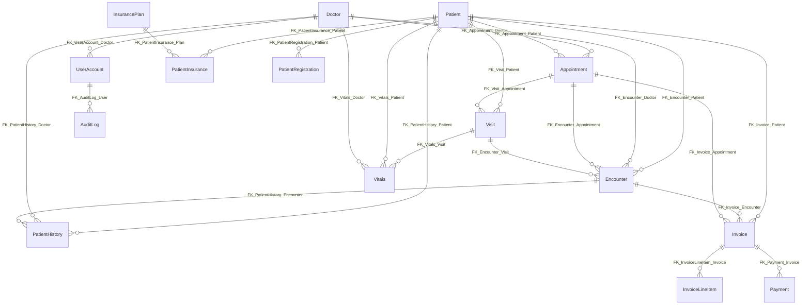

# Clinic application database — schema reference (from `ClinicApplicationDBMay.bak`)

This document summarizes what can be recovered from the SQL Server backup file **`ClinicApplicationDBMay.bak`** without restoring it. The backup is a **binary** format; the details below were extracted from **embedded database diagram metadata** (table names, foreign keys) and **CHECK constraint text** visible in the backup stream.

**Important limitation:** Individual **columns, data types, indexes, and exact `CREATE TABLE` scripts** are **not** reliably readable from the `.bak` file alone. For authoritative DDL, restore the database on SQL Server and run **“Generate Scripts”** (or query `sys.tables` / `INFORMATION_SCHEMA`) as described in §2.

Your API project currently targets **`ClinicalApplicationDB`** in `appsettings.json`; the backup filename suggests **`ClinicApplicationDB`** — confirm the logical database name after restore (§2).

---

## 1. What is in this database (business scope)

The model is a **clinic management** system covering:

- **Identity & staff:** `UserAccount`, `Doctor` (users link to doctors).
- **Patients:** `Patient`, `PatientRegistration`, `PatientInsurance`, `InsurancePlan`, `PatientHistory`.
- **Scheduling & visits:** `Appointment`, `Visit`, `Encounter`, `Vitals`.
- **Billing:** `Invoice`, `InvoiceLineItem`, `Payment`.
- **Audit:** `AuditLog`.

SQL Server **Database Diagram** support objects may also be present: `sysdiagrams`, related procedures (`sp_helpdiagrams`, etc.). These are tooling tables, not domain entities.

---

## 2. Restore the backup and export real DDL (recommended)

On a machine with **SQL Server** (Windows, or Docker/Linux image):

1. Restore the file (adjust paths and logical file names if needed):

   ```sql
   RESTORE FILELISTONLY FROM DISK = N'/path/to/ClinicApplicationDBMay.bak';
   RESTORE DATABASE ClinicApplicationDB
     FROM DISK = N'/path/to/ClinicApplicationDBMay.bak'
     WITH REPLACE, RECOVERY;
   ```

2. In **SSMS**: right-click the database → **Tasks** → **Generate Scripts** → include schema (and data if needed).

3. Or query metadata:

   ```sql
   SELECT TABLE_SCHEMA, TABLE_NAME
   FROM INFORMATION_SCHEMA.TABLES
   WHERE TABLE_TYPE = 'BASE TABLE'
   ORDER BY TABLE_SCHEMA, TABLE_NAME;
   ```

Use that script as the source of truth for **Entity Framework** models or migrations.

---

## 3. Tables (alphabetical)

| Table | Purpose (inferred) |
|-------|---------------------|
| `Appointment` | Scheduled visit with doctor/patient; status/type constrained (see §5). |
| `AuditLog` | User action audit trail (`action` constrained). |
| `Doctor` | Provider profile; referenced by appointments, encounters, vitals, history, user accounts. |
| `Encounter` | Clinical encounter linking **appointment**, **visit**, **patient**, **doctor** (hub for billing/history). |
| `InsurancePlan` | Master list of insurance products/plans. |
| `Invoice` | Bill header; ties to patient, optional encounter/appointment; **status** for workflow. |
| `InvoiceLineItem` | Line-level charges for an invoice. |
| `Patient` | Demographics / MRN (aligns with your existing `Patient` entity). |
| `PatientHistory` | Clinical notes/history per patient, doctor, encounter. |
| `PatientInsurance` | Patient enrollment in a plan (`InsurancePlan`). |
| `PatientRegistration` | Registration workflow (`registration_status`). |
| `Payment` | Payments against an invoice (`method`). |
| `UserAccount` | Login accounts; optional link to `Doctor` (aligns with `doctor_id_FK` in your model). |
| `Visit` | Visit instance; **visit_status**; links to **appointment** and **patient**. |
| `Vitals` | Measurements for a **visit** (and **patient**/**doctor**). |

---

## 4. Foreign keys (from diagram / backup metadata)

| Constraint name | Child (FK) | Parent (PK referenced) |
|-----------------|------------|--------------------------|
| `FK_Appointment_Doctor` | `Appointment` | `Doctor` |
| `FK_Appointment_Patient` | `Appointment` | `Patient` |
| `FK_AuditLog_User` | `AuditLog` | `UserAccount` |
| `FK_Encounter_Appointment` | `Encounter` | `Appointment` |
| `FK_Encounter_Doctor` | `Encounter` | `Doctor` |
| `FK_Encounter_Patient` | `Encounter` | `Patient` |
| `FK_Encounter_Visit` | `Encounter` | `Visit` |
| `FK_Invoice_Appointment` | `Invoice` | `Appointment` |
| `FK_Invoice_Encounter` | `Invoice` | `Encounter` |
| `FK_Invoice_Patient` | `Invoice` | `Patient` |
| `FK_InvoiceLineItem_Invoice` | `InvoiceLineItem` | `Invoice` |
| `FK_PatientHistory_Doctor` | `PatientHistory` | `Doctor` |
| `FK_PatientHistory_Encounter` | `PatientHistory` | `Encounter` |
| `FK_PatientHistory_Patient` | `PatientHistory` | `Patient` |
| `FK_PatientInsurance_Patient` | `PatientInsurance` | `Patient` |
| `FK_PatientInsurance_Plan` | `PatientInsurance` | `InsurancePlan` |
| `FK_PatientRegistration_Patient` | `PatientRegistration` | `Patient` |
| `FK_Payment_Invoice` | `Payment` | `Invoice` |
| `FK_UserAccount_Doctor` | `UserAccount` | `Doctor` |
| `FK_Visit_Appointment` | `Visit` | `Appointment` |
| `FK_Visit_Patient` | `Visit` | `Patient` |
| `FK_Vitals_Doctor` | `Vitals` | `Doctor` |
| `FK_Vitals_Patient` | `Vitals` | `Patient` |
| `FK_Vitals_Visit` | `Vitals` | `Visit` |

### 4.1 Relationship diagram (high level)



---

## 5. CHECK constraints / allowed values (extracted from backup)

These literals appear in constraint definitions. Map each column to its table when you script the real DDL (names are unique except `status`, which appears on multiple tables — the database enforces per-table checks).

| Column | Allowed values |
|--------|----------------|
| `role` | `Doctor`, `Staff`, `Admin` |
| `sex` | `Male`, `Female`, `Other` |
| `appointment_type` | `New`, `Follow-up` |
| `visit_status` | `Open`, `Closed` |
| `registration_status` | `New`, `Verified`, `Inactive` |
| `method` (payments) | `Cash`, `Card`, `Insurance`, `EFT` |
| `action` (audit) | `INSERT`, `UPDATE`, `DELETE`, `LOGIN` |

**`status`** appears with **three** different domain sets in the backup (different tables):

1. **Appointment-like:** `Scheduled`, `Checked-In`, `Completed`, `Cancelled`, `No-show`
2. **Open/Closed pair:** `Open`, `Closed` (likely a second table using a column named `status`; confirm via generated script)
3. **Invoice-like:** `Draft`, `Sent`, `Paid`, `Void`

A **date check** fragment also appears (e.g. comparing a `[date]` column to `CONVERT(date, GETDATE())`) — verify exact predicate in SSMS.

---

## 6. Core workflow (for API design)

1. **Register / verify patient** → `Patient`, `PatientRegistration`.
2. **Insurance** → `InsurancePlan`, `PatientInsurance`.
3. **Book appointment** → `Appointment` (doctor + patient + type/status).
4. **Visit** → `Visit` from `Appointment`; record **vitals**.
5. **Encounter** links the **clinical episode** to appointment + visit + patient + doctor; **history** rows attach here.
6. **Billing** → `Invoice` (+ optional encounter/appointment), `InvoiceLineItem`, `Payment`.
7. **Audit** → `AuditLog` on authenticated actions.

---

## 7. Mapping to your current ASP.NET project

In `ClinicManagmentAPIs` you already have:

- `Patient` → table `Patient` with columns such as `patient_id`, `mrn`, `first_name`, … — consistent with this database.
- `UserAccount` → `UserAccount` with `user_id`, `doctor_id_FK`, `role`, … — consistent with `FK_UserAccount_Doctor`.

**Next steps for a full system:**

1. Restore `.bak` and generate **full SQL DDL**.
2. Add **EF Core** entity classes for each remaining table (or **scaffold** from DB: `dotnet ef dbcontext scaffold ...`).
3. Register `DbSet<>` entries and optional `OnModelCreating` for relationships, indexes, and enums matching §5.
4. Implement **controllers/services** following the workflow in §6 and enforce the same allowed values at the API (DTO validation) to match SQL `CHECK` constraints.

---

## 8. File reference

- Backup analyzed: `ClinicApplicationDBMay.bak` (~5.8 MB Microsoft SQL Server backup).
- Documentation generated: `ClinicManagmentAPIs/docs/ClinicApplicationDB-schema-from-backup.md` (this file).

If you later export `Schema.sql` from SQL Server, you can replace §3–§5 with the exact `CREATE TABLE` statements for a complete column-level reference.
